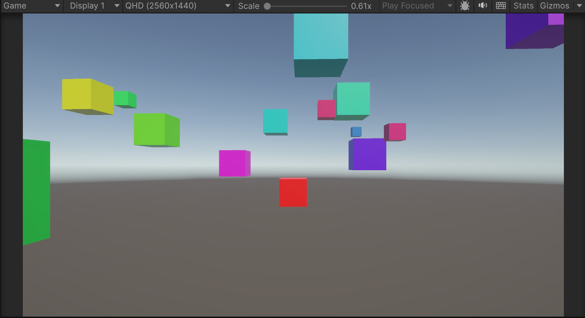
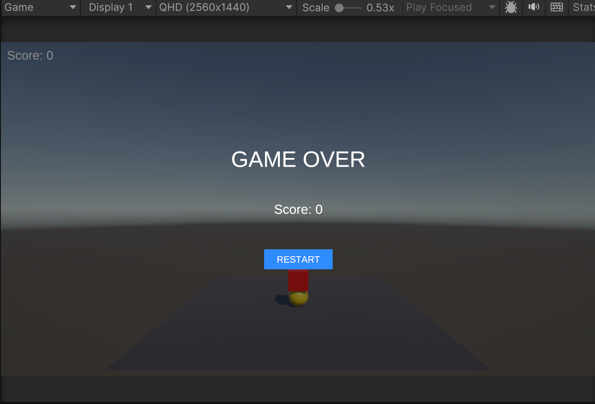

# 🟥 BlockDodge

> 落ちてくるブロックを避け続けるシンプルなアーケードゲーム。

上から次々と降ってくるブロックを左右に動いて避け、どれだけ長く生き残れるかを競う Unity 製ゲームです。


---

## 📸 スクリーンショット

| ゲーム中 | ゲームオーバー |
|---|---|
|  |  |

---

## 🎮 操作方法

| キー | 動作 |
|---|---|
| ← / A | 左に移動 |
| → / D | 右に移動 |

ブロックに当たるとゲームオーバー。スコアは生存時間に応じて加算されます。

---

## ✨ 特徴

- **シンプルな操作** — キーボード左右キーのみで遊べる
- **スコアシステム** — 生存時間がそのままスコアに
- **ゲームオーバー画面** — スコアを表示しリスタート可能
- **URP 対応** — Universal Render Pipeline で描画

---

## 🛠️ 技術スタック

| カテゴリ | 技術 |
|---|---|
| ゲームエンジン | Unity 6000.4.5f1 |
| 言語 | C# |
| レンダリング | Universal Render Pipeline (URP) |
| 入力 | Unity Input System |
| UI | TextMesh Pro |

---

## 📁 ディレクトリ構成

```
Assets/
├── Scenes/
│   └── SampleScene.unity       # メインシーン
├── Scripts/
│   ├── GameManager.cs          # スコア・ゲームオーバー管理
│   ├── PlayerController.cs     # プレイヤー移動・当たり判定
│   ├── FallingBlock.cs         # 落下ブロック挙動
│   └── BlockSpawner.cs         # ブロック生成制御
├── Settings/                   # URP レンダリング設定
└── TextMesh Pro/               # フォントアセット
```

---

## 🚀 実行方法

1. Unity Hub でプロジェクトを開く（Unity 6 推奨）
2. `Assets/Scenes/SampleScene` を開く
3. Play ボタンで実行
